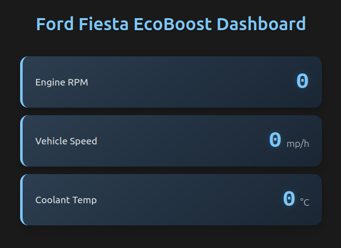

# Real-Time OBD-II Dashboard



A clean web interface to monitor your car's performance data using browser-based JavaScript.

## Files
- `index.html` - Dashboard structure
- `styles.css` - Modern dark theme styling
- `script.js` - Handles all OBD-II communication and live updates

## Quick Start
1. Connect your ELM327 adapter (USB/Bluetooth)
2. Open `index.html` in Chrome/Firefox
3. Allow browser access to OBD adapter when prompted

## Key Functions (script.js)
```javascript
// Main OBD connection handler
function connectOBD() { ... }

// Data refresh (2x/sec)
setInterval(fetchOBDData, 500);

// Example PID request
function getRPM() {
  return obd.query('010C');
}
